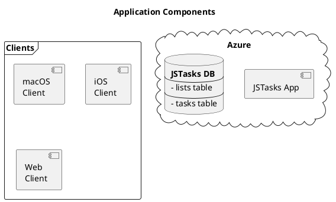
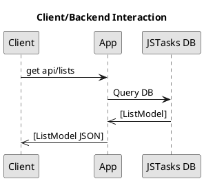

# JSTasks Design

**JSTasks** is an implementation of a simple TODO list application. The application consists of a backend server, a [PostgreSQL](https://www.postgresql.org/) database and various clients.

## High Level Architecture

## Backend

The server is written using the [Vapor](https://vapor.codes) framework and uses [PostgreSQL](https://www.postgresql.org/) for its database.

### Database

The PostgreSQL database is named `jstasks` and contains two tables, `lists` and `tasks`.

#### Lists

A list is a way to group a set of tasks together.

##### Properties

- id
- name
- tasks

#### Tasks

A task is a single thing to be done. Tasks can belong to a single list.

##### Properties

- id
- title
- notes
- due-date
- priority

### Routes

#### Lists

- `get api/lists`: Get all lists and their tasks
- `get api/list/listID`: Get the tasks for `listID`
- `post api/lists`: Create a new list

#### Tasks

- `get api/tasks`
- `get task/taskID`
- `post api/task`
- `delete api/task/taskID`

### Deployment

The server is designed to be deployed as a [Docker](https://www.docker.com/) container.

## Clients

The initial client will be a native macOS application, followed by an iOS application a web client.

### macOS

- Written using SwiftUI.
- Supports macOS 10.15 and later

### iOS

TBD

### Web

TBD
Need to decide whether to use the Leaf templating engine, React or somethign else.
