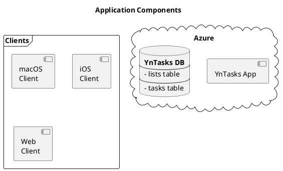
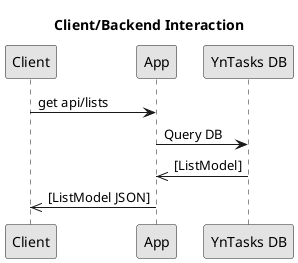

# YnTasks Design

**YnTasks** is an implementation of a simple TODO list application. The application consists of a backend server, a [PostgreSQL](https://www.postgresql.org/) database and various clients.

## High Level Architecture

```puml
@startuml YnTasks Components
skinparam monochrome true
title <b>Application Components
frame Clients {
component "macOS\nClient"
component "iOS\nClient"
component "Web\nClient"
}
cloud Azure {
component "YnTasks App"
database YnTasks [
<b>YnTasks DB
---
- lists table
---
- tasks table
]
}
@enduml
```

```puml
@startuml Sequence
skinparam monochrome true
title <b>Client/Backend Interaction
Client -> App: get api/lists
App -> "YnTasks DB": Query DB
"YnTasks DB" ->> App: [ListModel]
App ->> Client: [ListModel JSON]
@enduml
```

## Clients

The macOS and iOS clients are SwiftUI applications located in `YnTasksApp/`. They share common views and a `YnListsViewModel` through the `YnTasksApp/Shared/` directory, and communicate with the backend via a shared API client (`YnTasksAPI`).

## Backend

The server is written using the [Vapor](https://vapor.codes) framework and uses [PostgreSQL](https://www.postgresql.org/) for its database.

### App

The application is written using Vapor 4, connecting to a [PostgreSQL](https://www.postgresql.org/) database.

#### Lists

A list is a way to group a set of tasks together.

##### Properties

* id
* name
* tasks

#### Task

A task is a single thing to be done. Tasks can belong to a single list.

##### Properties

* id
* title
* notes
* due-date
* priority
* complete

#### Health Check

* `get health`: Check application status

#### List Routes

* `get api/lists`: Get all lists and their tasks
* `get api/list/listID`: Get the tasks for `listID`
* `post api/lists`: Create a new list

#### Task Routes

* `get api/tasks`
* `get task/taskID`
* `post api/task`
* `patch api/task/taskID`
* `delete api/task/taskID`

### Database

A PostgreSQL database, named `YnTasks` is used to store all of the data for the application and contains two tables, `lists` and `tasks`.

#### Tables

* lists
  * name
  * [tasks]

* tasks
  * title
  * priority
  * notes
  * due date
  * complete

### YnShared

A shared Swift library (`YnShared`) contains Codable models (`YnListModel`, `YnTaskModel`) used by both the backend and the client applications.

### Deployment

The server is designed to be deployed as a [Docker](https://www.docker.com/) container. The Docker Compose configuration includes an [nginx](https://nginx.org/) reverse proxy and [Certbot](https://certbot.eff.org/) for Let's Encrypt SSL/TLS certificate management.
