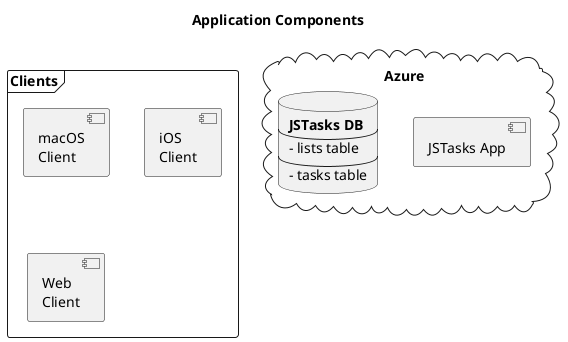
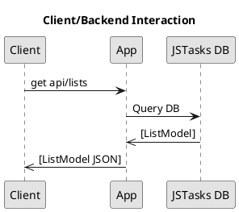

# JSTasks Design

**JSTasks** is an implementation of a simple TODO list application. The application consists of a backend server, a [PostgreSQL](https://www.postgresql.org/) database and various clients.

## High Level Architecture

## Backend

The server is written using the [Vapor](https://vapor.codes) framework and uses [PostgreSQL](https://www.postgresql.org/) for its database.

### App

The application is written using Vapor 4, connecting to a [PostgreSQL](https://www.postgresql.org/) database.

#### Lists

A list is a way to group a set of tasks together.

##### Properties

* id
* name
* tasks

#### Task

A task is a single thing to be done. Tasks can belong to a single list.

##### Properties

* id
* title
* notes
* due-date
* priority

#### List Routes

* `get api/lists`: Get all lists and their tasks
* `get api/list/listID`: Get the tasks for `listID`
* `post api/lists`: Create a new list

#### Task Routes

* `get api/tasks`
* `get task/taskID`
* `post api/task`
* `delete api/task/taskID`

### Database

A PostgreSQL database, named `jstasks` is used to store all of the data for the application.related to  and contains two tables, `lists` and `tasks`.

#### Tables

* lists
  * name
  * [tasks]

* tasks
  * title
  * priority
  * notes
  * due date

### Deployment

The server is designed to be deployed as a [Docker](https://www.docker.com/) container.
